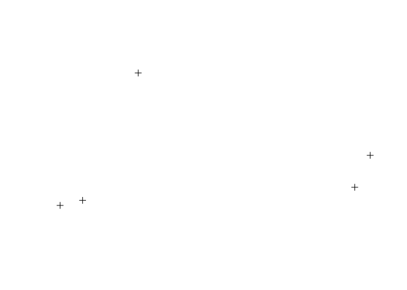

<!-- README.md is generated from README.Rmd. Please edit that file -->
nominatim is an R package to interface to the [OpenStreeMap Nominatim API](http://wiki.openstreetmap.org/wiki/Nominatim).

From the wiki:

> Nominatim (from the Latin, 'by name') is a tool to search OSM data by name and address and to generate synthetic addresses of OSM points (reverse geocoding). It can be found at nominatim.openstreetmap.org.
>
> Nominatim is also used as one of the sources for the search box on the OpenStreetMap home page. Several companies provide hosted instances of Nominatim that you can query via an API, for example see MapQuest Open Initiative, PickPoint or the OpenCage Geocoder.

Most functions hit the [MapQuest Nominatim API](http://open.mapquestapi.com/nominatim/) as recommended by OpenStreetMap.

The following functions are implemented:

-   `address_lookup`: Lookup the address of one or multiple OSM objects like node, way or relation.
-   `osm_geocode`: Search for places by address
-   `osm_search`: Search for places
-   `osm_search_spatial`: Search for places, returning a list of 'SpatialPointsDataFrame', 'SpatialLinesDataFrame' or a 'SpatialPolygonsDataFrame'
-   `reverse_geocode_coords`: Reverse geocode based on lat/lon
-   `reverse_geocode_osm`: Reverse geocode based on OSM Type & Id

### News

-   Version 0.1.1.9000 released : address lookup, switch API server, API timeout watch
-   Version 0.1.0.9000 released : "spatial" stuff
-   Version 0.0.0.9000 released

### NOTE

-   Data © OpenStreetMap contributors, ODbL 1.0. <http://www.openstreetmap.org/copyright>
-   Nominatim Usage Policy: <http://wiki.openstreetmap.org/wiki/Nominatim_usage_policy>
-   MapQuest Nominatim Terms of Use: <http://info.mapquest.com/terms-of-use/>

### TODO

-   Enable configuration of timeout
-   Enable switching Nominatim API server providers
-   Better spatial support

### Installation

``` r
devtools::install_github("hrbrmstr/nominatim")
```

### Usage

``` r
library(nominatim)
#> Data (c) OpenStreetMap contributors, ODbL 1.0. http://www.openstreetmap.org/copyright
#> Nominatim Usage Policy: http://wiki.openstreetmap.org/wiki/Nominatim_usage_policy
#> MapQuest Nominatim Terms of Use: http://info.mapquest.com/terms-of-use/

# current verison
packageVersion("nominatim")
#> [1] '0.1.1.9000'

# Reverse geocode Canadian embassies
# complete list of Canadian embassies here:
# http://open.canada.ca/data/en/dataset/6661f0f8-2fb2-46fa-9394-c033d581d531

embassies <- data.frame(
  lat=c("34.53311", "41.327546", "41.91534", "36.76148", "-13.83282",
        "40.479094", "-17.820705", "13.09511", "13.09511"),
  lon=c("69.1835", "19.818698", "12.50891", "3.0166", "-171.76462",
        "-3.686115", "31.043559", "-59.59998", "-59.59998"),
  osm_type=c("R", "W", "R", "N", "N", "W", "R", "N", "N"),
  osm_id=c("3836233", "267586999", "3718093", "501522082", "305640297",
           "309487691", "2793217", "501458399", "501458399"),
  stringsAsFactors=FALSE)

emb_coded_coords <- reverse_geocode_coords(embassies$lat, embassies$lon)
head(emb_coded_coords)
#> Source: local data frame [6 x 24]
#> 
#>     place_id                                                                             licence osm_type     osm_id
#> 1  141554854 Data © OpenStreetMap contributors, ODbL 1.0. http://www.openstreetmap.org/copyright      way  251884280
#> 2  140380416 Data © OpenStreetMap contributors, ODbL 1.0. http://www.openstreetmap.org/copyright      way  248349387
#> 3   17419117 Data © OpenStreetMap contributors, ODbL 1.0. http://www.openstreetmap.org/copyright     node 1690405094
#> 4   23022786 Data © OpenStreetMap contributors, ODbL 1.0. http://www.openstreetmap.org/copyright     node 2261850466
#> 5    6676195 Data © OpenStreetMap contributors, ODbL 1.0. http://www.openstreetmap.org/copyright     node  687791952
#> 6 2657152894 Data © OpenStreetMap contributors, ODbL 1.0. http://www.openstreetmap.org/copyright      way   98280735
#> Variables not shown: lat (dbl), lon (dbl), display_name (chr), address29 (chr), road (chr), city (chr), state (chr),
#>   country (chr), country_code (chr), monument (chr), village_green (chr), county (chr), postcode (chr), bus_stop (chr),
#>   neighbourhood (chr), suburb (chr), city_district (chr), house_number (chr), pub (chr), house (chr)

emb_coded_osm <- reverse_geocode_osm(embassies$osm_type, embassies$osm_id)
#> Error connecting to geocode serviceError in curl::curl_fetch_memory(url, handle = handle): Timeout was reached
head(emb_coded_osm)
#> Source: local data frame [6 x 15]
#> 
#>     place_id                                                                             licence osm_type    osm_id
#> 1  194135434 Data © OpenStreetMap contributors, ODbL 1.0. http://www.openstreetmap.org/copyright relation   3836233
#> 2  146632013 Data © OpenStreetMap contributors, ODbL 1.0. http://www.openstreetmap.org/copyright      way 267586999
#> 3  151591965 Data © OpenStreetMap contributors, ODbL 1.0. http://www.openstreetmap.org/copyright relation   3718093
#> 4    1372733 Data © OpenStreetMap contributors, ODbL 1.0. http://www.openstreetmap.org/copyright     node 305640297
#> 5 2612043014 Data © OpenStreetMap contributors, ODbL 1.0. http://www.openstreetmap.org/copyright      way 309487691
#> 6  151467740 Data © OpenStreetMap contributors, ODbL 1.0. http://www.openstreetmap.org/copyright relation   2793217
#> Variables not shown: lat (dbl), lon (dbl), display_name (chr), city (chr), county (chr), state (chr), country (chr),
#>   country_code (chr), road (chr), village (chr), locality (chr)

# lookup some places from the wiki example

places <- c("R146656", "W104393803", "N240109189")
places_found <- address_lookup(places)
head(places_found)
#> Source: local data frame [3 x 22]
#> 
#>     place_id                                                                             licence osm_type    osm_id
#> 1  127761056 Data © OpenStreetMap contributors, ODbL 1.0. http://www.openstreetmap.org/copyright relation    146656
#> 2   77769745 Data © OpenStreetMap contributors, ODbL 1.0. http://www.openstreetmap.org/copyright      way 104393803
#> 3 2570600569 Data © OpenStreetMap contributors, ODbL 1.0. http://www.openstreetmap.org/copyright     node 240109189
#> Variables not shown: lat (chr), lon (chr), display_name (chr), class (chr), type (chr), importance (chr), city (chr),
#>   county (chr), state_district (chr), state (chr), country (chr), country_code (chr), attraction (chr), house_number
#>   (chr), pedestrian (chr), suburb (chr), city_district (chr), postcode (chr)

# more general search

osm_search("[bakery]+berlin+wedding", limit=5)
#> Source: local data frame [5 x 15]
#> 
#>     place_id                                                                             licence osm_type     osm_id
#> 1    9039748 Data © OpenStreetMap contributors, ODbL 1.0. http://www.openstreetmap.org/copyright     node  939667448
#> 2 2659941153 Data © OpenStreetMap contributors, ODbL 1.0. http://www.openstreetmap.org/copyright     node 3655549445
#> 3   23586341 Data © OpenStreetMap contributors, ODbL 1.0. http://www.openstreetmap.org/copyright     node 2299953786
#> 4    7161987 Data © OpenStreetMap contributors, ODbL 1.0. http://www.openstreetmap.org/copyright     node  762607353
#> 5   29179742 Data © OpenStreetMap contributors, ODbL 1.0. http://www.openstreetmap.org/copyright     node 2661679367
#> Variables not shown: lat (dbl), lon (dbl), display_name (chr), class (chr), type (chr), importance (dbl), icon (chr),
#>   bbox_left (dbl), bbox_top (dbl), bbox_right (dbl), bbox_bottom (dbl)

# address search

osm_geocode(c("1600 Pennsylvania Ave, Washington, DC.",
              "1600 Amphitheatre Parkway, Mountain View, CA",
              "Seattle, Washington"))
#> Source: local data frame [3 x 15]
#> 
#>     place_id                                                                             licence osm_type   osm_id
#> 1 2661769953 Data © OpenStreetMap contributors, ODbL 1.0. http://www.openstreetmap.org/copyright relation  5396194
#> 2   47189532 Data © OpenStreetMap contributors, ODbL 1.0. http://www.openstreetmap.org/copyright      way 13367984
#> 3  151183715 Data © OpenStreetMap contributors, ODbL 1.0. http://www.openstreetmap.org/copyright relation   237385
#> Variables not shown: lat (dbl), lon (dbl), display_name (chr), class (chr), type (chr), importance (dbl), icon (chr),
#>   bbox_left (dbl), bbox_top (dbl), bbox_right (dbl), bbox_bottom (dbl)

# spatial
library(sp)
plot(osm_search_spatial("[bakery]+berlin+wedding", limit=5)[[1]])
```



### Test Results

``` r
library(nominatim)
library(testthat)

date()
#> [1] "Wed Jul 29 09:25:39 2015"

test_dir("tests/")
#> testthat results ========================================================================================================
#> OK: 0 SKIPPED: 0 FAILED: 0
#> 
#> DONE
```

### Code of Conduct

Please note that this project is released with a [Contributor Code of Conduct](CONDUCT.md). By participating in this project you agree to abide by its terms.
